# Global Car Sales Revenue Analysis for 2023

## Introduction
This project is to display my acquired skills in data analysis using a realistic test data that I came across online. I admired how rich the data was and thought of exhibiting my data analytics skills of critical thinking, data cleaning, analysis and visualization. I used Excel for data cleaning, and imported the dataset into PostgreSQL for exploratory data analysis. I later moved the data to Power BI for a more detailed data analysis and visualization. Finally, I was able to derive insights and make recommendations.

**Note:** The problem statement is a hypothetical case scenario I thought about after reviewing the dataset.
***

## Problem Statement
The automotive industry witnessed a significant shift in consumer preferences, economic conditions, and technological developments in 2023, which greatly affected the revenue realized from the sale of cars. This data analysis project aims to explore and understand the trends, patterns, and insights derived from global car sales revenue data in the year 2023. By analyzing this data, we can gain valuable insights into market dynamics, customer behavior, and profitability factors, which can inform strategic decision-making for stakeholders in the automotive industry.

**After thinking critically, we aim to address the following questions:**
1.	What were the top-selling car makes and models in terms of revenue?
2.	How did car sales revenue vary by car color?
3.	What is the distribution of sales revenue across different customer demographics such as gender and country?
4.	Are there any notable trends or patterns in sales revenue over the months of 2023?
5.	Compare the total profits generated in each of the months?
***

## Data Sourcing
The data was sourced online from [mockaroo.com](https://www.mockaroo.com), a website which allows you to generate up to 1,000 rows of free mock data in CSV, JSON, SQL, and Excel formats. Though the analysis was on the global scale, however, I generate the data with the condition of limiting the country set to; Australia, Canada, Germany, United Sates, and United Kingdom. Also, I limited the datetime to six months period; from 01/01/2023 to 06/30/2023, with the date format as <code>yyyy-mm</code>. I then downloaded the data in a CSV format, ready for cleaning and analysis. Below is a screenshot of the filtering.

***

## Data Assessment and Cleaning
First, I had to format the raw worksheet of the data into a table form in order to get the correct count of the number of rows. After inserting a table, I checked the number of rows and columns in the data. There were 15 columns and 1000 rows. Below is a snapshot preview of the dataset after the formatting into a table form.

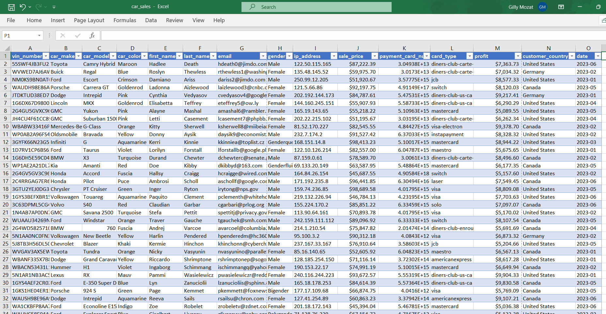

What I did next was to check for null values in the data set but there wasn't any.

Next, I decided to remove duplicates in the data set if there were any. I selected the entire data by using the <code>Ctrl + A</code> shortcut command and navigated to the **Table Design** tab. From there, I selected **Remove Duplicates** and the command window popped-up, allowing me to select the option to check for duplicates in all columns. After running the result, there was a pop-up window indicating that there were no duplicate values in the data.

###### _Remove Duplicates command snapshot_

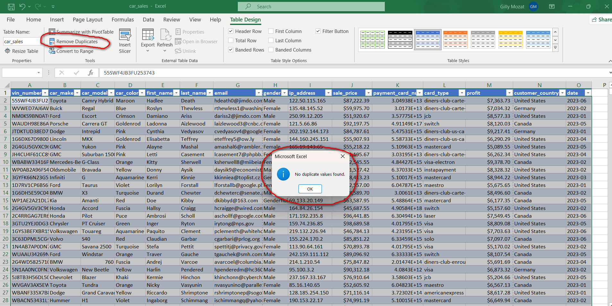

Also, I noticed that, the <code>sale_price</code> and <code>profit</code> columns were assigned the <code>Currency</code> data type which wouldn't function properly applying some aggregation functions in Postgres SQL. I had to change both data types to <code>Numeric</code> for the purpose of aggregation during the exploratory data analysis on PostgreSQL. The snapshots below indicate the "before and after" change of data type between the two columns.

###### _Before sale_price and profit data type change_

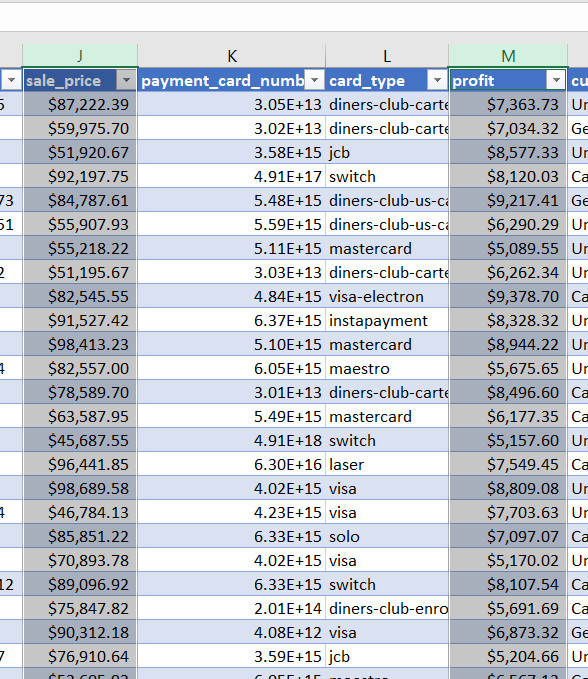

###### _Affect sale_price and profit columns data type change_
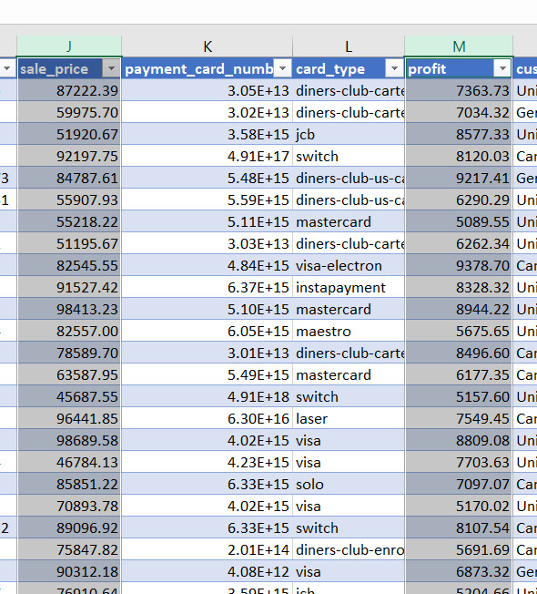

After reviewing the data in the columns, I decided to delete three columns because they would not be relevant to my analysis. These columns were <code>ip_address</code> which contained the internet protocol (IP) addresses of each of the customers, <code>payment_card_number</code> which contained the credit card numbers of the customers, and <code>card_type</code> which contained the type of cards customers used for payment.

Again, I had to create a new column labeled <code>month_from_date</code> where I extracted the names of the respective months from the <code>date</code> column by using the <code>IF()</code> conditional function.

###### _If() function to extract month names_

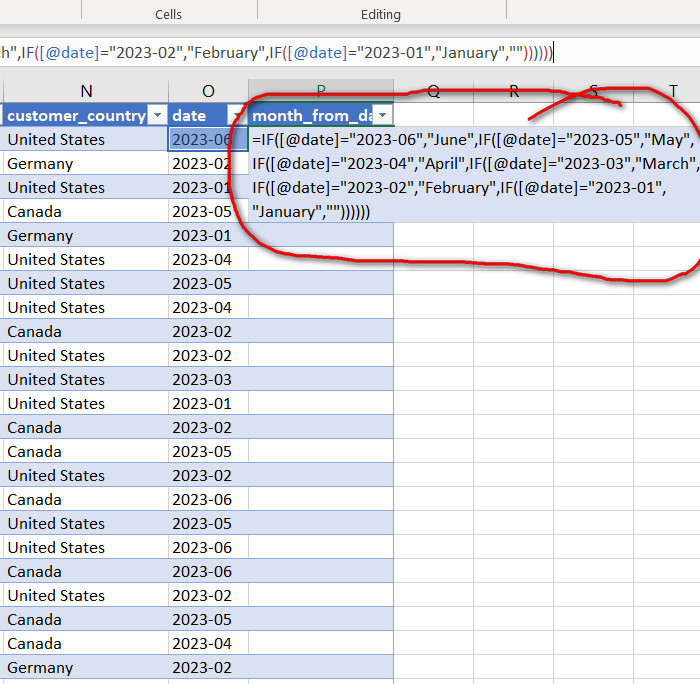

###### _After If() function was executed_

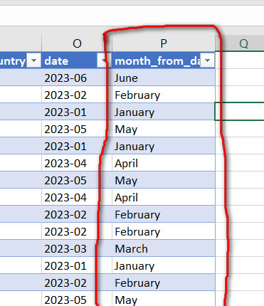

Below is the screenshot of the data set after I finished with the data assessment and cleaning. This dataset was exported into PostgreSQL server for exploratory data analysis.

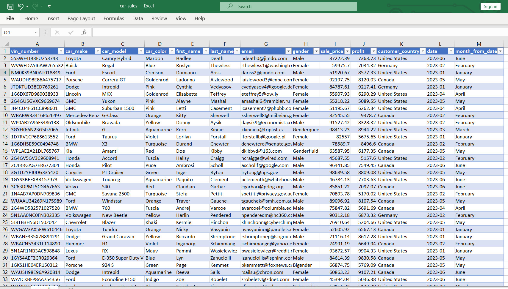
***

## Exploratory Data Analysis

I used postgres SQL to conduct the exploratory data analysis. First, I had to write the query to connects us to the <code>carDatabase</code> database where the table <code>car_sales</code> is residing. I first had to SELECT all the columns from the <code>car_sales</code> table. Also, I limited the output to the first ten rows in order to keep the output clean.

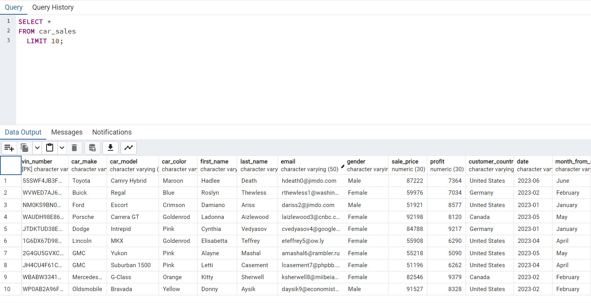

Then I started the exploration by looking at the number of distinct cars. This would help us to know the different car manufacturers involved in this analysis.

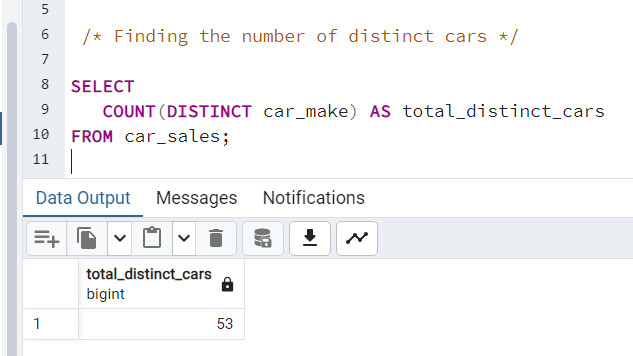

Next, I had to explore the top 10 selling cars by car makes in terms of revenue.

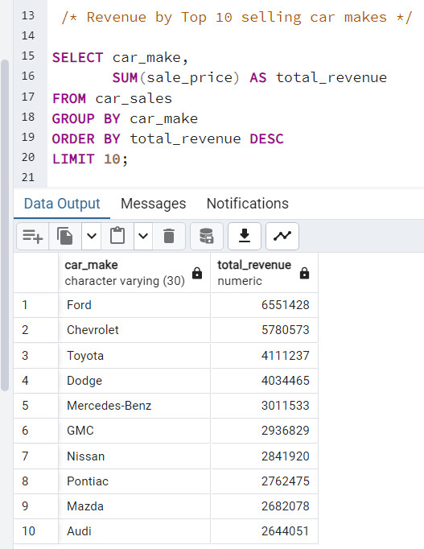

Furthermore, I checked the sales revenue for the top 5 selling cars by model.

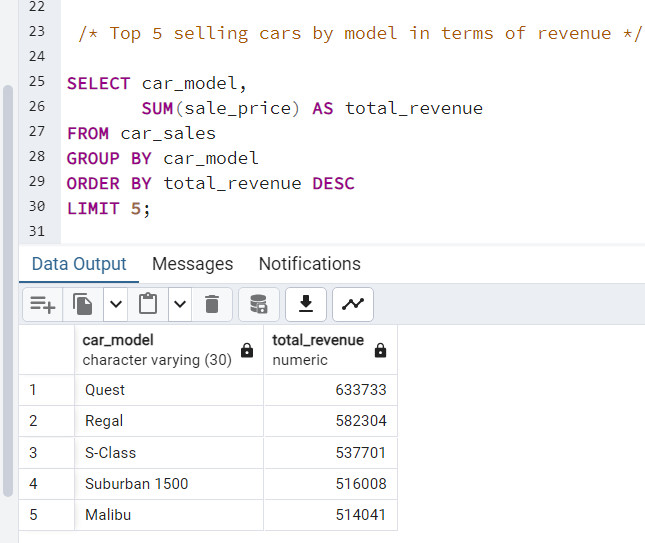

Also, I had to check how car sales revenue varied by car color. I limited the output to the first 5 rows to discover the top-5 colors with the most revenue.

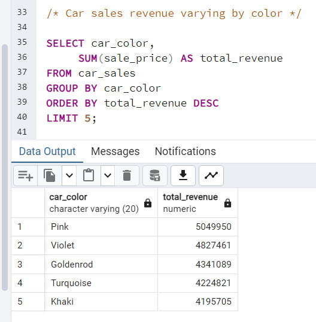

Then I checked the distribution of sales revenue by gender. Top 5 list were selected.

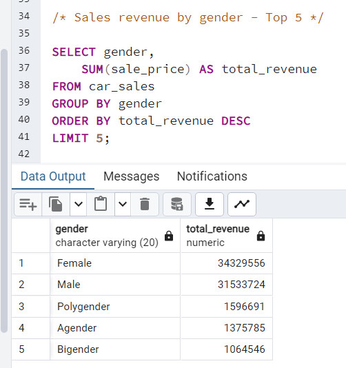

Moreover, I ran a query to discover which country had the highest sales revenue, down to the lowest revenue.

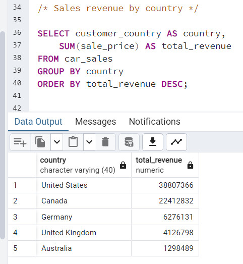

Furthermore, I checked sales revenue over the 6 months period, the total revenue for each month; from January to June of 2023. We will analysis this in Power BI visual to discover whether there are any notable trends or patterns in sales revenue over the months.

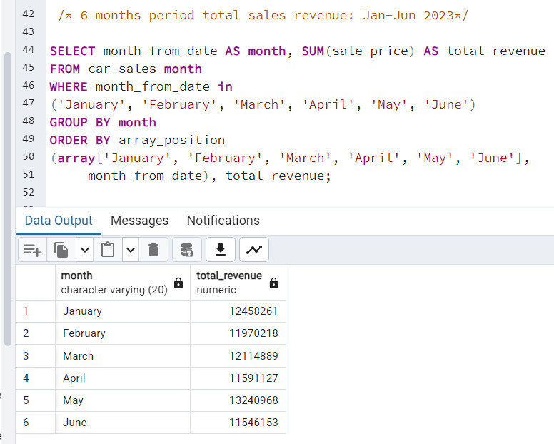

Next, I checked the total profit by month to discover which month was most profitable.

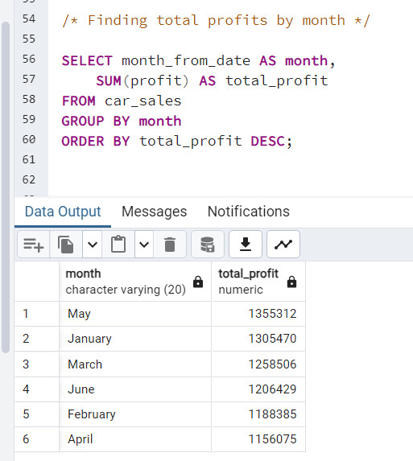

Finally, I exported the data into Power BI for a detailed analysis and visualization.
***

# Power BI
## Data Analysis Expression (DAX) Concepts
Normally, as a standard procedure for me, whenever I am working with data which has dates, I use the Data Analysis Expression (DAX) function in Power BI to create a date table to aid with time intelligence analysis instead of using the original date columns which may have some limitations. I created the new date table labeled <code>Calendar</code>, with the column name <code>Date</code>. Below is the DAX formula I used to create the date table.

I also created a new column labeled <code>Month</code> and extracted all the respective names of the months from the <code>Date</code> column of the <code>Calendar</code> table. Below is the DAX function I used to extract the names of the months to the <code>Month</code> column.

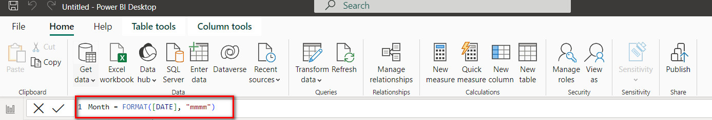

## Data Modelling
I established a relationship between the new and existing table by using Power BI's data modelling tool. I connected the two tables using the date columns and a star schema (1:*) relationship was established. Below is a preview of the data model.

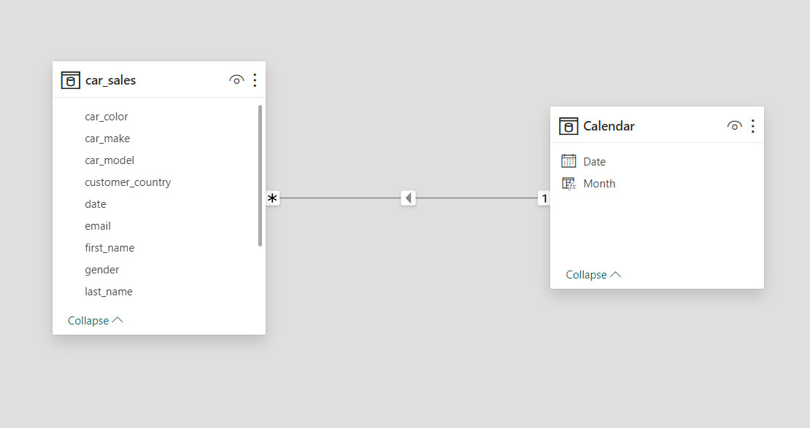

## Data Visualization and Analysis

You can interact with the [Power BI report here](https://app.powerbi.com/view?r=eyJrIjoiMWYyNTEwODctYWYyOC00NzU4LTkwNGItZDcxODc1OWZmODBmIiwidCI6ImZkMjljODFlLWI1YzUtNDAzNS1hZGIyLTBmMGJjODhiMzM2NyJ9 )

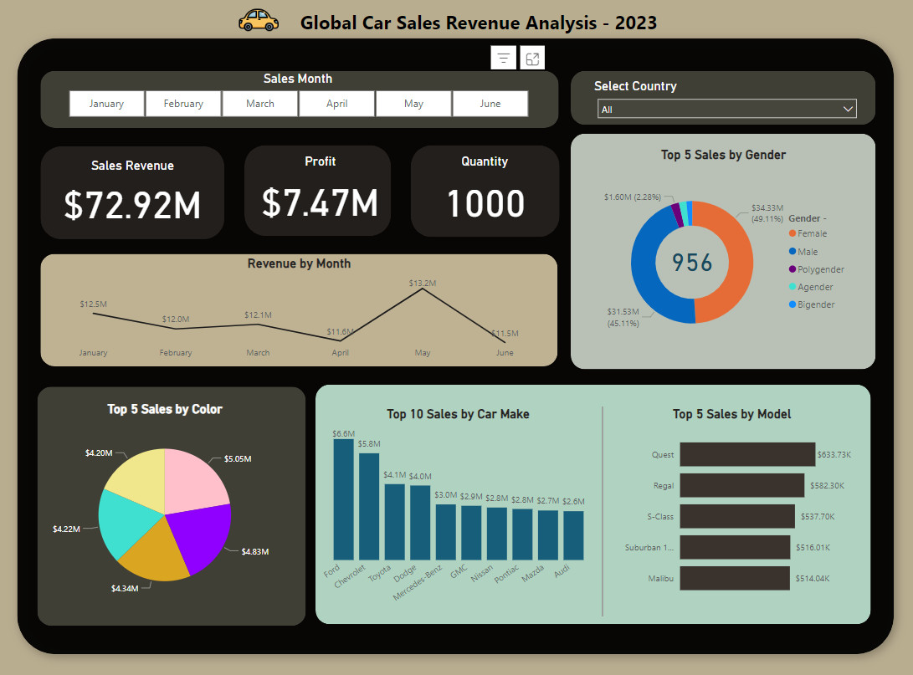

On the report page, I added a slicer which filters sales by month, from January to June.

The key performance indicators I added include:
- Sales Revenue (total sales from January to June)
- Profit (total profit from January to June for all sold cars)
- Quantity (total quantity of all sold cars)

I also added the option to filter sales revenue and all other indicators by country. United States recorded the highest sales with the amount of $38.81M

A line chart was also included to help discover any notable trends in sales revenue over the 6 months period.

I sorted the best 5 genders in terms of sales revenue. The gender which generated the most revenue in the whole 6 month period is the <code>Female</code> gender, with the amount of $34.33M in sales.

Using a pie chart, I analyzed how sales differ by color types.

Also, I analyzed the top 10 car-makes and top 5 models in terms of sales revenue using column chart and bar chart.

***

## Insights and Recommendations

### Insights:
1. **Top Selling Cars by Make:** Ford appears as the leading car-make in terms of revenue, with the total sales of $6.6M, followed by Chevrolet ($5.8M) and Toyota ($4.1M). This indicates strong brand presence and consumer demand for these manufacturers' vehicles.

2. **Top Selling Cars by Model:** The top-selling models include Quest, Regal, and S-Class, suggesting that these models are mostly the consumers' choice, possibly due to their features, performance, or pricing.

3. **Sales Revenue by Car Color:** Unconventional colors like Pink, Violet, and Goldenrod surprisingly generated significant revenue, indicating a potential trend towards more unique and personalized color choices among consumers.

4. **Sales Revenue by Gender:** Female customers contributed a higher revenue compared to male customers, indicating the importance of understanding and catering to the preferences and needs of female car buyers in marketing and product development strategies.

5. **Sales Revenue by Country:** The United States leads in sales revenue, followed by Canada and Germany, highlighting the importance of these markets for global car sales. Targeted marketing efforts and product localization strategies can further enhance sales performance in these regions.

6. **Sales Revenue Over the Months:** Sales revenue shows fluctuation over the 6 months period, with May recording the highest revenue of the amount of $13.2M. This could be due to various factors such as seasonal trends, promotional activities, or new product launches during that period.

### Recommendations:
1. **Strategic Partnerships:** Collaborate with dealerships and online platforms to promote top-selling models and capitalize on consumer preferences.

2. **Product Diversity:** Expand color options to cater for diverse consumer tastes, especially considering the significant revenue generated by non-traditional colors.

3. **Gender-focused Marketing:** Develop marketing campaigns tailored to female consumers to capitalize on their higher contribution to sales revenue.

4. **International Expansion:** Invest in market research and localization efforts to further penetrate key markets like the United States, Canada, and Germany, while also exploring growth opportunities in emerging markets.

5. **Seasonal Promotions:** Implement targeted promotional strategies during peak sales months, leveraging insights from sales revenue trends to maximize revenue potential.
***

## Conclusion:
The analysis of global car sales revenue for 2023, January to June, has provided valuable insights into consumer behavior, market dynamics, and revenue trends within the automotive industry. From the top-selling car makes and models to the influence of car color, gender, country, and month on sales revenue, this analysis offers actionable insights for automakers and marketers to refine their strategies and drive business growth.

By understanding and adjusting to consumer preferences, leveraging strategic partnerships, and prioritizing market-specific approaches, stakeholders can enhance their competitive advantage and capitalize on opportunities for growth in the evolving automotive industry. Through continuous monitoring and analysis of sales data, industry players can stay alert and responsive to changing market trends, ensuring sustained success and profitability in the global car sales market.
***

###### My objective is to deliver value to the stakeholders, rather than just creating reports and dashboards.

Thank You!

